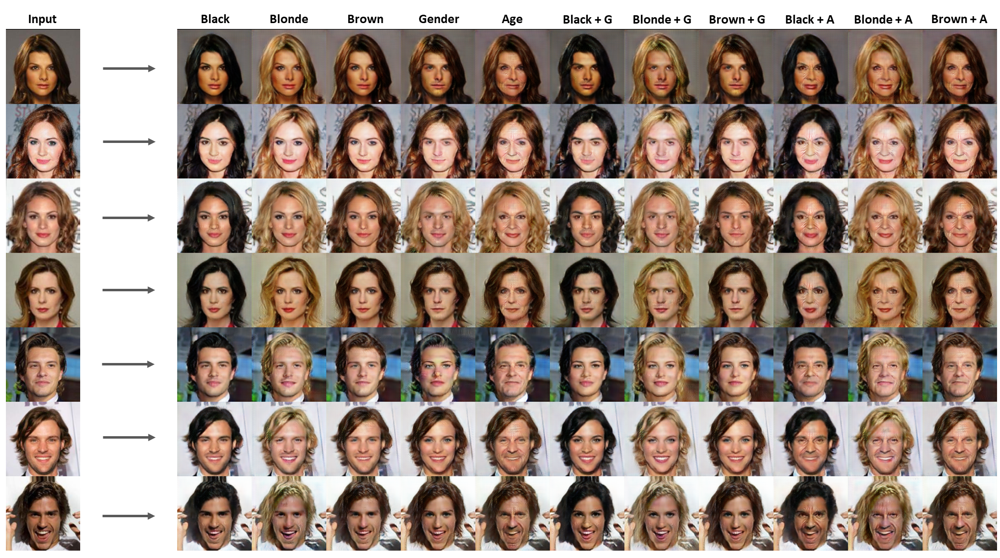
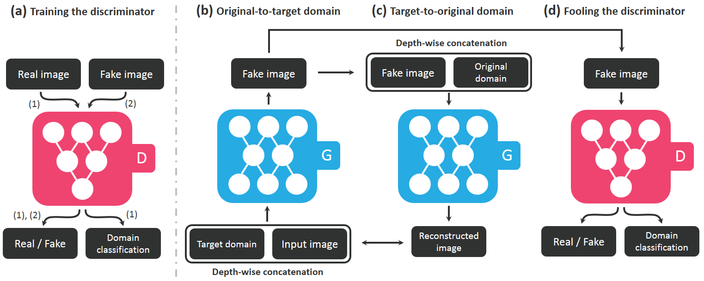

# StarGAN-pytorch
__Pytorch__ implementation of [StarGAN : Unified Generative Adversarial Networks for Multi-Domain Image-to-Image Translation](https://arxiv.org/abs/1711.09020).
This model can translate an input image into multiple domains by concatenating extra label vectors. Mask vector is not implemented.

## Result
You can see the more results for all the test images in `png`. The results have a same order with images below(input, black, blonde, brown ...)

## Model

## Dataset
### CelebA  
I seperated test images into male and female to see the difference clearly because gender translation is the hardest work for this model. 
Follwing is the location of each file.  
* __Annotation file__ : `data`  
* __Training images__ : `data/img`    
* __Test images - Male__ : `data/test/0`  
* __Test images - Female__ : `data/test/1`  

## How to train  
* Training from scratch  
`python train.py --img_dir=data/img --ann_path=data/list_attr_celeba.txt --result_dir=result --weight_dir=weight`  
  
* Load weight  
`python train.py --img_dir=data/img --ann_path=data/list_attr_celeba.txt --result_dir=result --weight_dir=weight --load_weight`  
